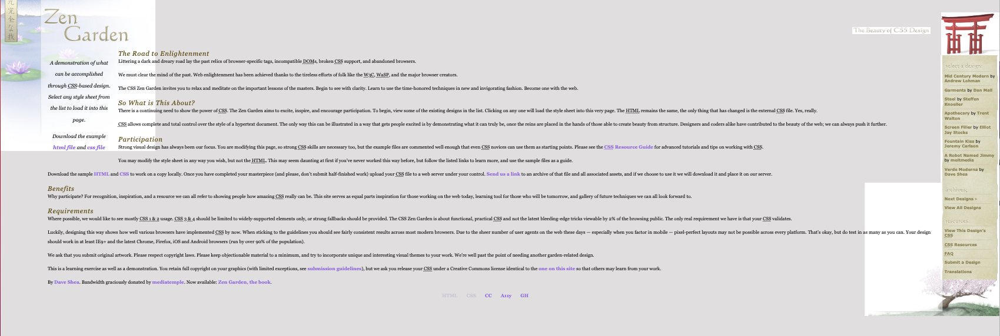

# zen-garden

## Description

The application is a project that was built in class to show the power of using css. The Zen garden aim is to Inspire, and encourage participation. To begin, view some of the existing designs in the list. Clicking on any one will load the style sheet into this very page. The HTML remains the same, the only thing that has changed is the external CSS file.

## Installation

1.  Clone the repository to your local machine using:
    git clone https://github.com/SKhail/zen-garden.git
    cd Weather-Dashboard
2.  Once cloned, you can start the application
3.  You will have it in your local machines and can start the Application.

## Usage

1.  Clone the repository to your local machine using:
    git clone https://github.com/SKhail/zen-garden.git
    cd Weather-Dashboard
2.  Once cloned, you can start the application
3.  Access the deployed application [Deployed Site Link] https://skhail.github.io/zen-garden/
4.  You will have it in your local machines and can start the Application.
5.  Refer to the screenshot below to see the application

## Feature

N/A

## Credits

N/A

## License

This project is licened under the MIT License.

## Resources

N/A
